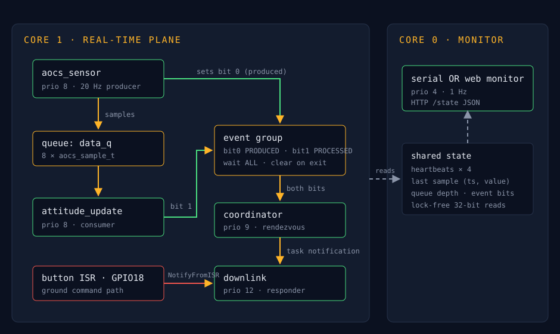

# SAT-1 — Real-Time Systems Final Capstone

SAT-1 is a dual-core satellite telemetry pipeline where a 20 Hz AOCS sensor stream flows through an attitude state machine and downlinks packets on demand, monitored live over HTTP without disturbing the real-time core.

## Demo
- Video: https://youtu.be/jRPCkK2l7JQ
- Live Wokwi: `https://wokwi.com/projects/471096476750143489`
- Portfolio site: https://teon55123business-create.github.io/Capstone-Project

## Architecture

Data flows top-to-bottom on Core 1: `aocs_sensor` (20 Hz) → `data_q` (8 × 8-byte samples) → `attitude_update`. Control flows through an event group — the `coordinator` waits atomically for PRODUCED and PROCESSED, then wakes `downlink` via direct task notification, the same primitive the button ISR uses as an independent ground-command path. Core 0 runs the observability plane (serial monitor or App 1's ported HTTP server, one `#define` apart), reading state through lock-free 32-bit variables so watching the system never perturbs it.

Integrated from prior apps: App 1's Wi-Fi/HTTP server (the web monitor), App 3's measurement patterns (the latency and WCET evidence below). Cited block-by-block in the App 5 engineering README in `firmware/`.

## Tasks & timing (WCET evidence)
| Task | Period T | WCET C | U=C/T | Priority | Deadline |
|------|---------:|-------:|------:|---------:|----------|
| aocs_sensor | 50 ms | 33 µs | 0.0007 | 8 | next period (50 ms) |
| attitude_update | 50 ms (event-driven) | 2011 µs | 0.0402 | 8 | queue horizon (400 ms) |
| coordinator | 50 ms (event-driven) | 2907 µs | 0.0581 | 9 | next cycle |
| downlink | 50 ms (event-driven) | 2855 µs | 0.0571 | 12 | next cycle |
| monitor (Core 0) | 1000 ms | — | — | 4 | soft |

Total utilization U = 0.156 (RM bound for n=4: 0.757 — schedulable with large margin; EDF trivially feasible). Full table with notes: [docs/task-table.md](docs/task-table.md).

Measured IPC wake latency (validated runs — heartbeat counters matched for task-path, one sample per press for ISR-path):

| Path | Task notification | Binary semaphore |
|------|-------------------|------------------|
| task → task | 35 µs avg / 36 µs max (n=1661) | 41 µs avg / 42 µs max (n=1921) |
| ISR → task | 16 µs avg / 17 µs max (n=56) | 17 µs avg / 18 µs max (n=61) |

## Hazard analysis & standard mapping
Six hazards assessed with MIL-STD-882E-style severity, each mitigation mapped to NASA software-safety practice (NASA-GB-8719.13): sensor stall (timeout + annunciation), queue overflow (bounded-by-analysis + visible log-and-drop), downlink automation failure (independent command path — demonstrated in the video), spurious command edges (debounce), monitor failure (Core 0 isolation), and a startup ordering race found and fixed during test. Full table: [docs/hazard-analysis.md](docs/hazard-analysis.md).

## Graceful degradation
Injected live in the demo (hazard H3): the coordinator's notification is severed, killing the autonomous downlink. Detection is heartbeat divergence on the 1 Hz monitor (`resp` freezes while `prod/cons/coord` climb). The degraded mode is the manual ground-command path — button ISR → direct notification → `downlink` — which shares nothing with the failed path; telemetry flows on command while sensing and processing continue uninterrupted. Recovery is a rebuild.

## Build & run
- Toolchain: ESP-IDF (Wokwi `esp-idf` builder), target ESP32-S3-DevKitC-1.
- Simulate: open the Wokwi project `MCFARLANE-FINAL-RTS26Summer`, run. Default `USE_WEBSERVER=0` needs no Wi-Fi; the serial monitor prints the pipeline state once per second.
- Web monitor: set `USE_WEBSERVER=1` in `firmware/main.c`, run, wait for `Got IP`, open the page from Wokwi's network indicator.
- The button on GPIO18 is the ground-command input; `diagram.json` sets `"bounce": "0"`.
- Firmware and the full App 5 engineering README (queue sizing math, back-pressure policy, IPC trade studies, measurement methodology including two bugs found and fixed): [firmware/](firmware/).

## Tailored for
Flight-software / avionics firmware roles — the choices follow that lens: timing claims are measured with stated validity checks rather than asserted, a written hazard analysis maps mitigations to NASA software-safety practice, the failure demo shows detection and an independent degraded mode rather than a crash, and the observability plane is partitioned so it cannot perturb the control plane.

## License
MIT — see [LICENSE](LICENSE). Contributions welcome; the firmware builds in Wokwi with zero local setup, so the fastest way to experiment is to fork the Wokwi project.

